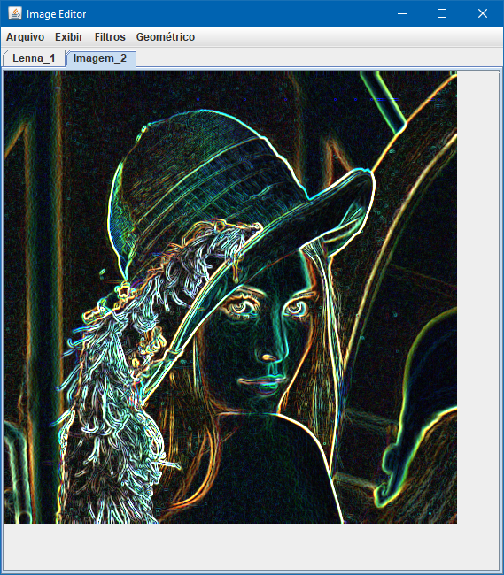

# Image Editor

## Description

The objective of the activity proposed by our teacher was to create a simple image editor to learn how image processing filters work.

## Example

[Lenna picture](https://en.wikipedia.org/wiki/Lenna) after [Sobel filter](https://en.wikipedia.org/wiki/Sobel_operator) applied.

## Source code

This source was written in Java language using [Eclipse](http://www.eclipse.org/) as IDE. All classes, methods, atributtes, etc. are written in English, but most of the user interface are written in Brazilian Portuguese (as required by the teacher).
